

# TravelVibe

**Where every journey finds its celebration.**

A travel and event-planning platform for Bangladesh. Discover destinations, book tours and venues, 
plan trips with AI and pay with bKash, all in one place.

 

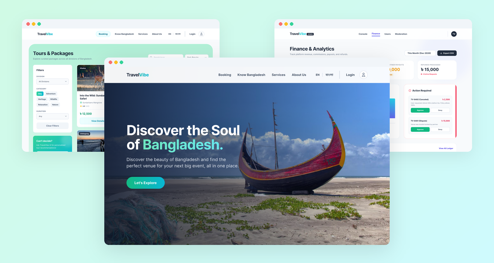

## Overview

TravelVibe is a UI/UX design project for one platform that brings together **destination discovery** and **occasion management** across Bangladesh. Travelers explore tours, heritage sites and event venues in all eight divisions. Local businesses list and manage what they offer. Administrators keep the marketplace running.

This repository holds the project overview and screenshots. The complete, clickable prototype is in Figma:

**[▶ Open the interactive prototype](https://www.figma.com/proto/nHoA51fSWXqSb2U3GG2XYt/Figma_TravelVibe---Where-Every-Journey-Finds-Its-Celebration-?node-id=288-5899)**

> [!NOTE]
> TravelVibe is a design prototype. There is no live backend, and all names, prices and bookings shown are sample data.

## Highlights

- **Three connected roles:** traveler, business partner and platform admin, each with its own dashboard and flows.
- **AI trip planner:** a short quiz (travel vibe, group, budget) that generates a customizable package of tour, venue and transport.
- **Local payments:** two-step checkout with card or bKash, including the bKash account and verification-code flow.
- **Bilingual:** English and বাংলা versions of the homepage.
- **Made for Bangladesh:** an interactive eight-division map, prices in taka (৳) and faith-based amenity filters such as halal catering, prayer rooms and segregated seating.
- **Community:** a travel blog, partner travelogues and a monthly photo contest with AI-scored entries and reward codes.

## Features

### Traveler

| Area | What it covers |
|---|---|
| Discover | Homepage, Know Bangladesh division map, travel blog |
| Tours & packages | Filters by division, category and duration; detail pages with 7-day weather, best time to visit, location map and reviews |
| Venues & event spaces | Filters by occasion, guest capacity and amenities; detail pages with a live cost estimate (hall fee + catering per plate) |
| AI planner & assistant | Quiz-based trip generator and an in-page chat assistant for recommendations |
| Transport | Multi-stop local rides and transfers with vehicle options |
| Checkout | Two-step secure checkout with card or bKash |
| My account | Dashboard, bookings, wishlist, messages, profile settings and photo-contest entries |

### Business partner

| Area | What it covers |
|---|---|
| Onboarding | Business verification with trade license or NID upload |
| Business overview | Monthly revenue, pending requests, rating and availability at a glance |
| Listings | Manage tours and venues; create listings with photos and amenities |
| Bookings | Accept, decline and complete bookings; availability calendar with block-out dates |
| Growth | Promotion codes and travelogues |
| Inbox | Messaging with travelers |

### Admin

| Area | What it covers |
|---|---|
| System console | Platform overview with quick access to every tool |
| Oversight | Users and roles, tours and venues, bookings, content moderation |
| Finance & analytics | Booking volume, platform commission, partner payouts, refunds and disputes |
| Photo contest | Review AI-scored entries and pick monthly winners |
| Support inbox | Conversations with travelers and partners |

## Screens

| Home | Home (বাংলা) |
|:---:|:---:|
| 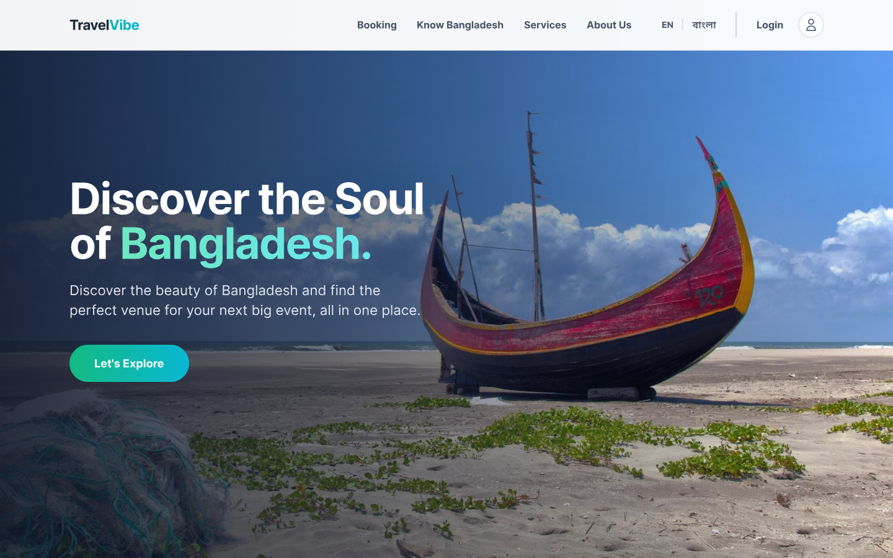 | 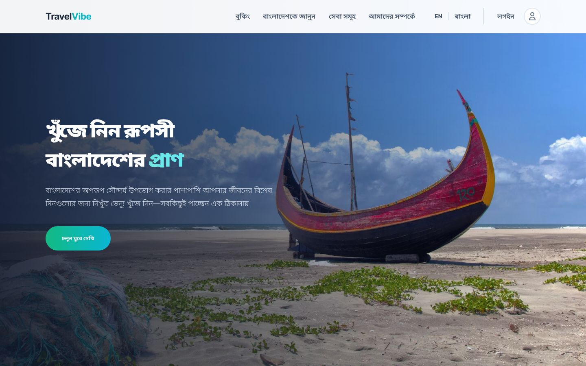 |
| **Tours & Packages** | **Venue detail with cost estimate** |
| 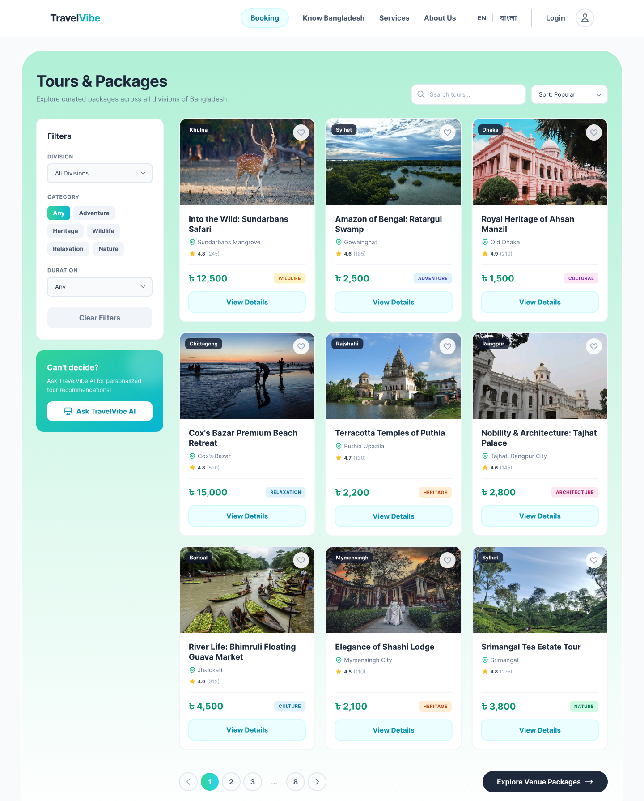 | 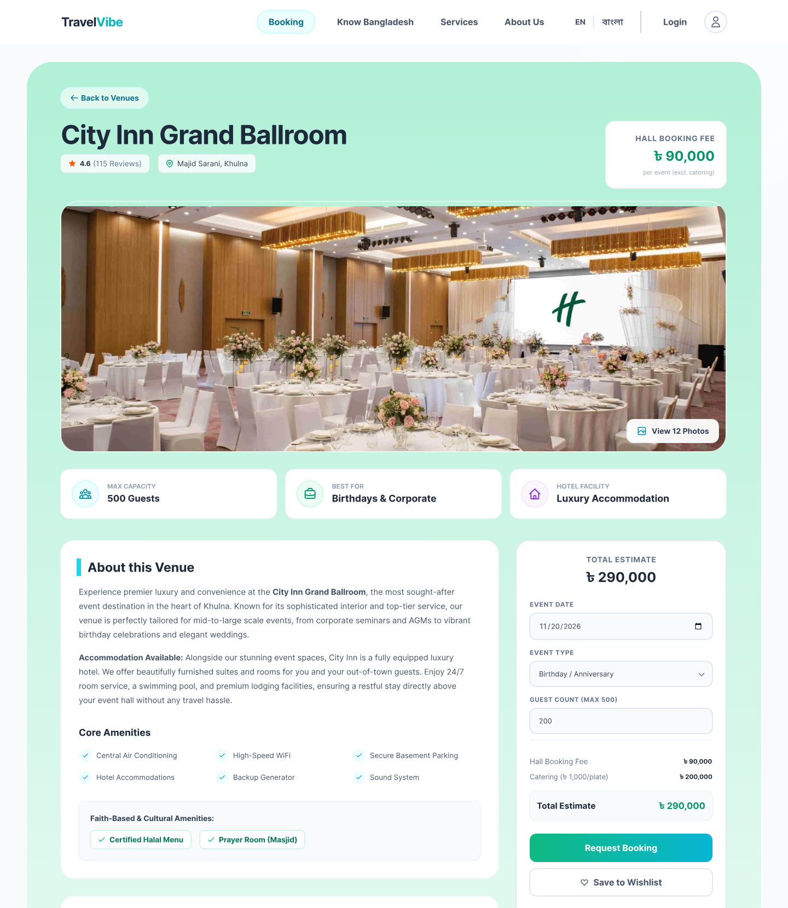 |
| **AI trip planner** | **Know Bangladesh map** |
| 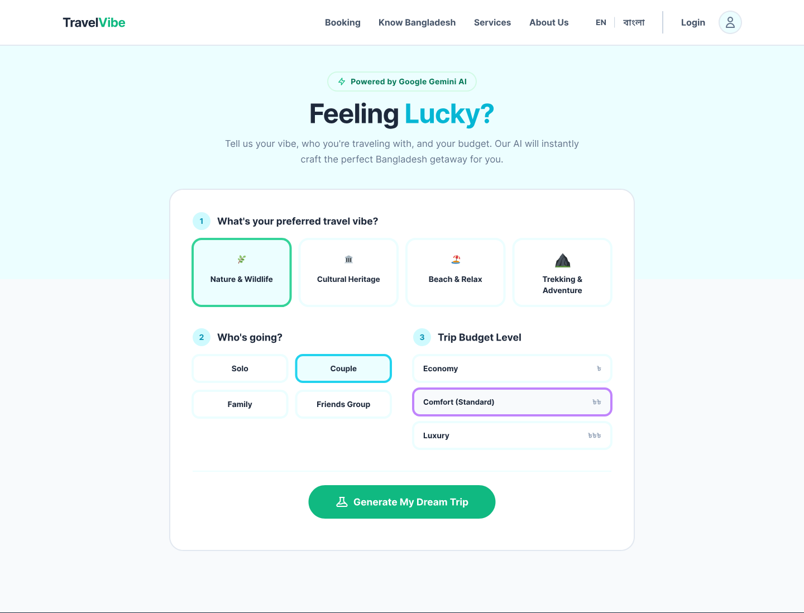 | 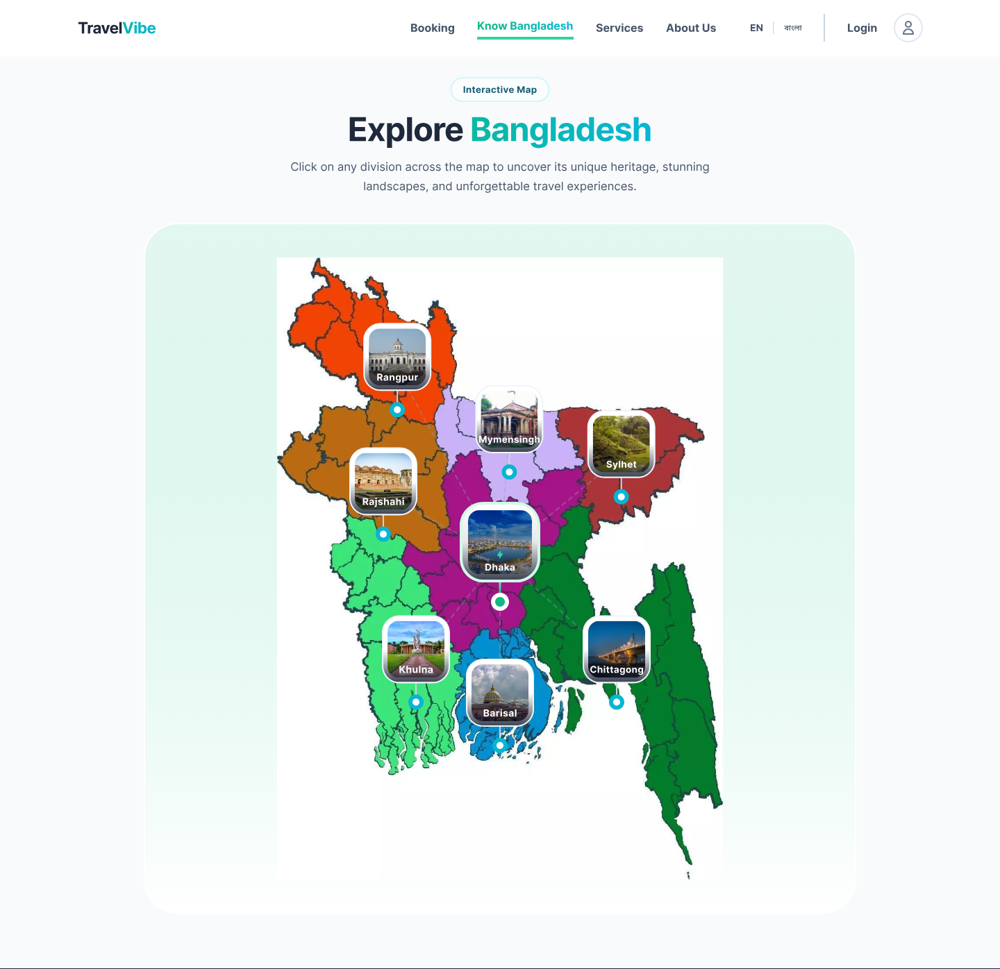 |
| **Secure checkout** | **bKash payment** |
| 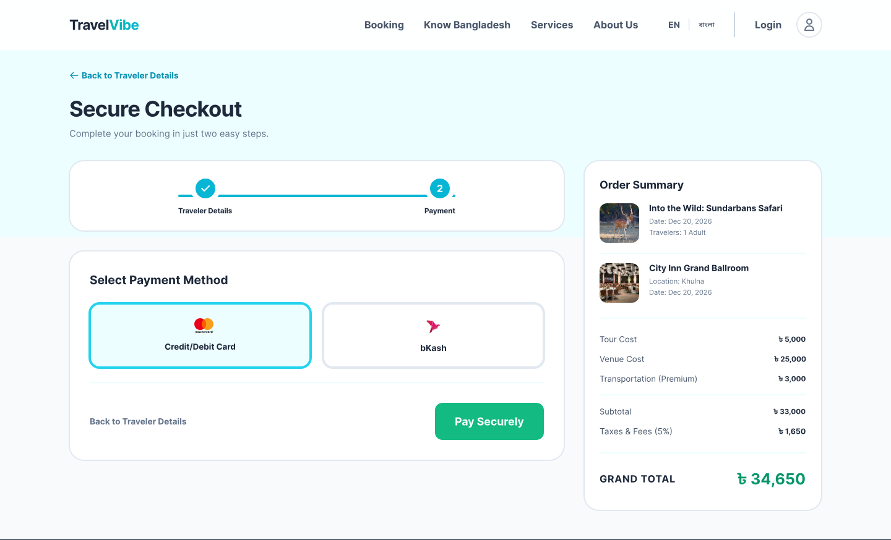 | 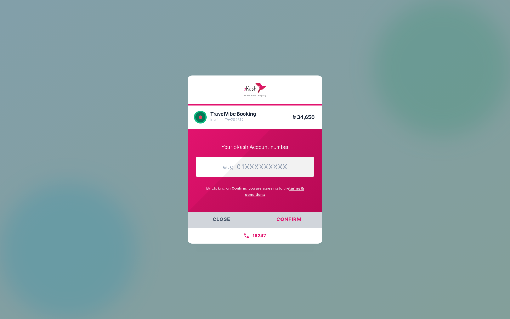 |
| **Partner dashboard** | **Admin finance & analytics** |
| 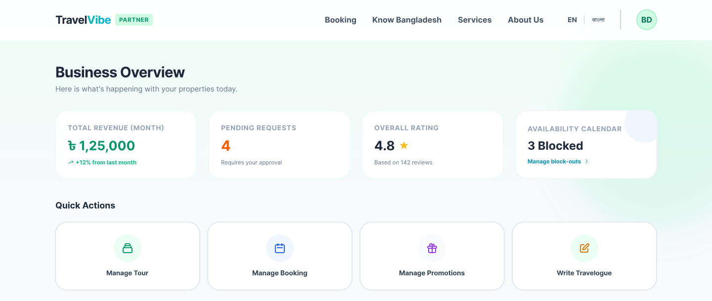 | 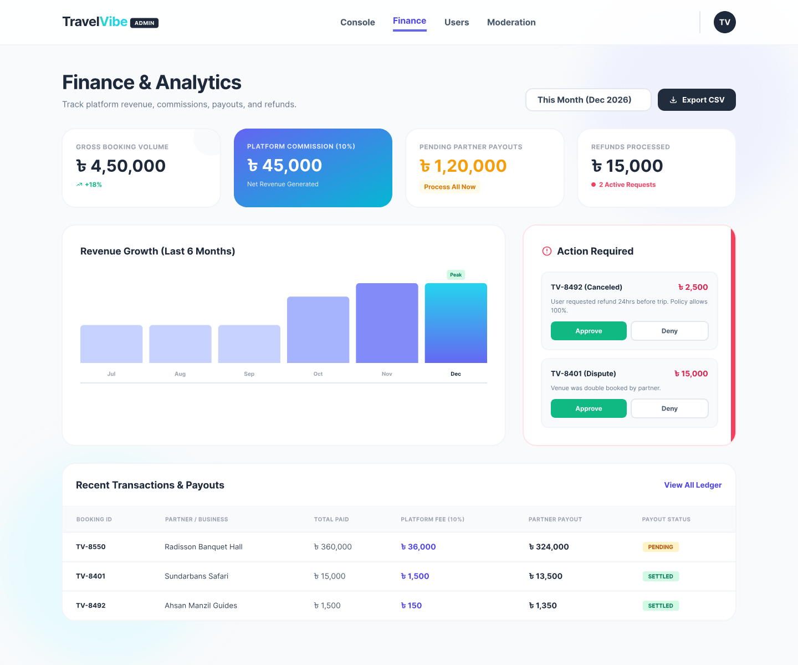 |

## Try these journeys in the prototype

1. **Book a trip:** Home → Tours & Packages → Tour detail → Venues → Venue detail → Transport → Checkout → bKash
2. **Plan with AI:** Home → AI planner quiz → Generated package → Checkout
3. **Explore Bangladesh:** Home → Know Bangladesh → Division → Blog post
4. **Run a business:** Partner dashboard → Manage tours → Create listing, or Travelogue → Published stories
5. **Administer the platform:** System console → Users, Bookings, Content, Finance or Photo contest

## Design system

| Element | Choice |
|---|---|
| Typeface | Inter (Bold, Semi Bold, Regular) |
| Primary action | Emerald-to-cyan gradient `#34D399 → #22D3EE` |
| Text | Slate `#1E293B` for headings, `#64748B` for body and meta |
| Surfaces | White cards on soft mint section gradients `#B1F0D7 → #FFFFFF` |
| Admin accent | Indigo `#4F46E5` |
| Layout | 1440 px desktop frames, 1280 px content width, Auto Layout throughout |
| Interaction | Smart Animate transitions and hover states on interactive components |

## Tools and workflow

- **HTML + Tailwind CSS:** screens were first built as web pages.
- **html.to.design:** imported the pages into Figma as editable layers.
- **Figma:** refined the layouts and wired the screens into an interactive prototype.

## Project info

- **Type:** Academic UI/UX design project
- **Platform:** Desktop web (1440 px)
- **Year:** 2026
- **Author:** Azahar Mahmud Chowdhury Rafi · [GitHub](https://github.com/Azahar-Mahmud)
- **Contributor:** Hridoy Ahmmad Akash · [GitHub](https://github.com/HridoyAhmmadAkash)

## License

Copyright © 2026 Azahar Mahmud Chowdhury Rafi. **All rights reserved.**

This work is shared for viewing and portfolio purposes only. No part of it may be copied, modified, redistributed or reused, including in academic submissions, without prior written permission. See [LICENSE](LICENSE) for details.

Photographs and map imagery come from third-party sources such as [Unsplash](https://unsplash.com) and Google Maps. bKash, Mastercard and other brand names and logos belong to their respective owners.
